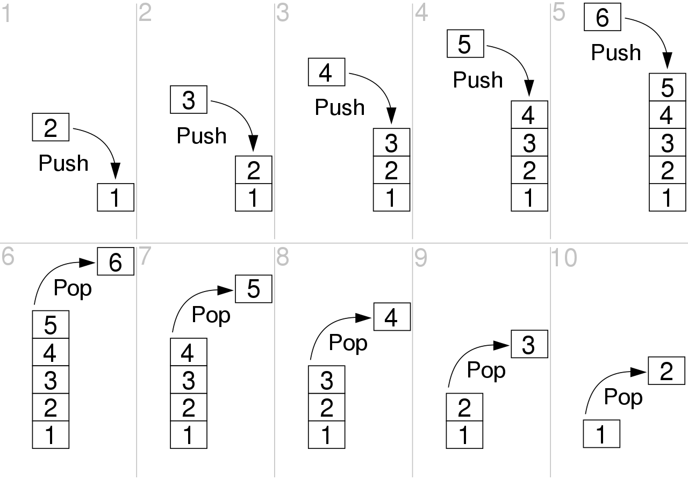
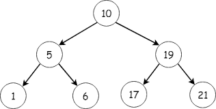

# Data Structures and Algorithms

Data structures are the foundation upon which you build your code. So a good understanding of data structures is important.

## Learning Objectives

- Understand some advanced data structures (beyond arrays and objects)
- Understand the time and space complexity (Big O) of some advanced data structures
- Understand hash tables
- Understand linked lists
- Implement linked lists in the form of stacks and queues

There is also an extended learning objective:

- Understand binary search trees

## Introduction

So far, the main [data types and data structures](https://developer.mozilla.org/en-US/docs/Web/JavaScript/Data_structures) you have been working with are the primitive types (such as booleans, numbers and strings), objects, arrays, and arrays of objects. You've also used [JSON](https://www.json.org/json-en.html), a structured data type that is commonly used for exchanging data between client and server (indeed, that's how you've used it).

However, native Javascript also includes some [keyed types](https://developer.mozilla.org/en-US/docs/Web/JavaScript/Guide/Keyed_collections), which we'll look at in the form of hash tables, below. We'll also look at [linked lists](https://en.wikipedia.org/wiki/Linked_list), and we'll use linked lists to create other data types, such as [stacks](https://en.wikipedia.org/wiki/Stack_(abstract_data_type)) and [queues](https://en.wikipedia.org/wiki/Queue_(abstract_data_type)).

## Hash Tables

Hash tables are a data structure where you use a key to store a value. Afterwards, you can use that key to retrieve the value.

Javascript has a native type for hash tables - the [Map](https://developer.mozilla.org/en-US/docs/Web/JavaScript/Reference/Global_Objects/Map). A Map is similar to an [Object](https://developer.mozilla.org/en-US/docs/Web/JavaScript/Reference/Global_Objects/Object), in that both let you set keys to values, retrieve those values, delete keys, and later, find whether something is stored at a key. Javascript only introduced the Map (and the [Set](https://developer.mozilla.org/en-US/docs/Web/JavaScript/Reference/Global_Objects/Set)) in 2015 (with ES6), so historically, Objects have predominated. However, there are [important differences between the two](https://developer.mozilla.org/en-US/docs/Web/JavaScript/Reference/Global_Objects/Map#objects_vs._maps), not least that a Map allows you to use _any_ value as a key, whereas an Object only allows a String; hence, in _some_ cases, a Map may be more appropriate.  

A javascript Map has the following main operations:

1. `set`, which adds an element
2. `get`, which fetches an element
3. `delete`, which removes an element
4. `has`, which checks whether the given key has an associated value
5. `size`, which reports the number of elements in the Map

```js
const contacts = new Map()
contacts.set('Steve', {phone: "0123 456789", address: "123 Easy Street"})
contacts.has('Steve') // true
contacts.get('Nathan') // undefined
contacts.set('Nathan', {phone: "0987 654321", address: "321 Hard Life"})
contacts.get('Steve') // {phone: "0123 456789", address: "123 Easy Street"}
contacts.delete('Ed') // false
contacts.delete('Nathan') // true
console.log(contacts.size) // 1
```

A Map does not allow duplicate keys. Hence:

```js
contacts.set('Steve', {phone: "0123 456789", address: "123 Easy Street"})
contacts.set('Steve', 'This will get overwritten with a new address')
contacts.set('Steve', {phone: "0456 987321", address: "321 A Tougher Road"})
```

And because keys must be unique, it is common to using a hashing algorithm (or a node package, such as [uuid](https://github.com/uuidjs/uuid)), to generate unique keys for you:

```js
import { v4 as uuidv4 } from 'uuid';
const myId = uuidv4(); // ⇨ '9b1deb4d-3b7d-4bad-9bdd-2b0d7b3dcb6d'
contacts.set(myId, {phone: "0123 456789", address: "123 Easy Street"});
contacts.get(myId) // {phone: "0123 456789", address: "123 Easy Street"}
```

### Hash Tables vs Arrays

Hash tables tend to be faster when looking up items because you just index into the hash table with a key, whereas, with an array, you have to loop over everything. Inserting an item is also generally faster in hash tables, as is deletion, since a hash table is just an unordered list, so unlike arrays, you never need to shift any of the elements to accomodate the inserted/deleted item.

In general, we have the following time complexity for hash tables and arrays:

| Hash Tables | Arrays      | Sorted Arrays   |
| ------------| ------------| ----------------|
| Search O(n) | Search O(n) | Search O(log n) |
| Lookup O(1) | Lookup O(n) | Lookup O(1)     |
| Insert O(1) | Insert O(1) | Insert O(n)     |
| Delete O(1) | Delete O(n) | Delete O(n)     |

If hash tables (generally) outperform arrays, why use arrays at all?

While the space complexity of both is generally O(n), you are still storing _more_ with a hashtable because it requires a key _and_ data, whereas, with an array, you just need to store the data. A hash table's key generation mechanism can also become complex (and therefore, computationally expensive). Hence, if you don't need keyed access, just use an array!

## Linked Lists

A linked list is an  [abstract data structure](https://en.wikipedia.org/wiki/Abstract_data_type) that functions similarly to an array. However, its implementation is different because a linked list is created by linking data through memory references.

Figure 1, below, shows single and double linked lists:


_Figure 1: Linked lists_

Below, we'll create a very simple, single linked list. We'll see more complex examples of a single linked list when looking at stacks, below. We'll look at double linked lists when discussing queues.

With a linked list, a _node_ stores both data and a reference to more data:

```js
const makeNode = (value) => {
  return {
    data: value,
    next: null
  }
}
```

Let's write a function that creates a list that counts down from a value:

```js
const makeCountDown = (from) => {
  let priorNode = makeNode(from);
  const head = priorNode;
  for (let i = priorNode.data - 1; i > 0; i--) {
    const newNode = makeNode(i);
    priorNode.next = newNode;
    priorNode = newNode;
  }
  return head;
};
```

`makeCountDown` shows the general approach for creating a linked list - first, we create a node to hold some data, then we form the list by linking that node to another by updating their `next` reference. Visually:

`10 -> 9 -> 8 -> 7 -> 6 -> 5 -> 4 -> 3 -> 2 -> 1`

Now, if we want to print the list, we just need to traverse the _next_ references:

```js
const printList = (head) => {
  // Start at the head
  let current = head;

  // As long as `current` isn't null, print out the value
  while(current) {
    console.log(current.data);

    // Advance to the next node in the list by replacing
    // current with whatever `next` points to
    current = current.next;
  }
}
```

Conceptually, that's all there is to linked lists! However, linked lists act as the foundation for more sophisticated data structures, such as stacks and queues, which can perform better than arrays when adding and deleting data. We'll look at stacks and queues, next.

## Stacks

A stack is a _last in, first out_ (LIFO) data type that behaves similarly to a stack of plates (or the [The Tower of Hanoi](https://www.mathsisfun.com/games/towerofhanoi.html)), because, as shown in Figure 2, adding or removing is only possible at the top.



_Figure 2: A stack_

A stack has two main operations:

1. `push`, which adds an element to the top of the stack
2. `pop`, which removes the most recently added element from the top of the stack

A singly linked list is an ideal data structure to implement a stack. When using a single linked list, the _head_ of the list functions as the _top_, which contains a reference to the _next_ element (if there is one), and `push` and `pop` modify the top of the stack alone. Consequently, stacks are super efficient because most operations are O(1) in time.

When you use your computer, you are _probably_ using stacks all the time!

+ [Memory allocation](https://en.wikipedia.org/wiki/Stack-based_memory_allocation)
+ [Call stack](https://en.wikipedia.org/wiki/Call_stack)

And how about those forward and back buttons on your browser?

## Queues

A queue is a _first in, first out_ (FIFO) data type that behaves similarly to your average post office, as shown in Figure 3 - if you join the queue first, you will be the first one to be served and leave the queue.


_Figure 3: A queue_

A queue has two main operations:

1. `enqueue`, which adds an element to the end (tail) of the collection
2. `dequeue`, which removes an element from the front (head) of the collection

A doubly linked list has O(1) insertion and deletion at both ends, so it is a natural choice for queues.

Below, you get to program stacks and queues.

## Exercise

1. Fork this repository and clone the fork to your machine
2. Run `npm ci` to install project dependencies
3. Implement each of the empty functions inside the [src/stack.mjs](src/stack.mjs) and [src/queue.mjs](src/queue.mjs) files
    - Add a commment to each function implementation that describes:
        1. Conceptually, how the algorithm works. You _may_ wish to write this _first_, then try and implement your conceptual understanding
4. Run `npm run test` to test your code

## Extension - Binary Search Trees

A tree is a collection of nodes connected by references ([edges](https://mathinsight.org/definition/network_edge), in maths terms).

Figure 4 shows that we have been working with a tree data structure since day 1 of this course!


_Figure 4: The DOM tree_

A binary tree is a special kind of tree data structure, shown in Figure 5, in which each node has at most two children (the left child and the right child).


_Figure 5: A binary tree_

A binary Search tree, shown in Firgure 6, is a special kind of binary tree in which nodes that have lesser value are stored on the left child, while the nodes with a higher value are stored at the right child.



_Figure 6: A binary search tree_

Hence, a binary search tree is also called an ordered or sorted binary tree, because it is a rooted binary tree data structure whereby each root node stores a key greater than all the keys in the node's left subtree and less than those in its right subtree.

## Extension Exercise

A binary search tree is an advanced data structure, so most of the functions in this repos' included implementation, [src/bst.mjs](src/bst.mjs), have been written for you (the breadth first traversal shows a very nice example of a queue). However, two functions have been left for you to complete in order to make `npm run test` pass _everything_: `findMinimum` and `findMaximum` - there are very nice [recursive](https://www.cs.utah.edu/~germain/PPS/Topics/recursion.html) solutions to both of those functions - can you find them?

For the record - the _search_ and _insert_ time complexities of a binary search tree are closely related to how many branches the tree contains (is height, or depth). It turns out that the average height of a binary search tree has space complexity of O(log n). Hence, it follows that the average number of comparisons needed to search a binary search tree is also O(log n) (which is the same complexity as that for binary search of a sorted array). However, inserting a new node also has time complexity of O(log n), which is better than the O(n) complexity of inserting an item into a sorted array. Hence, for sorted data, a binary search tree _might_ be the correct option.
